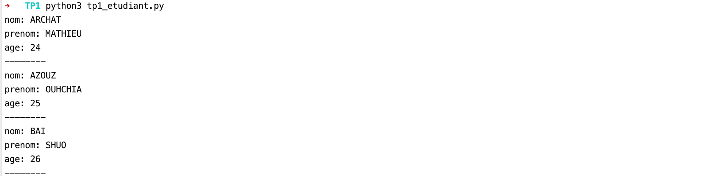
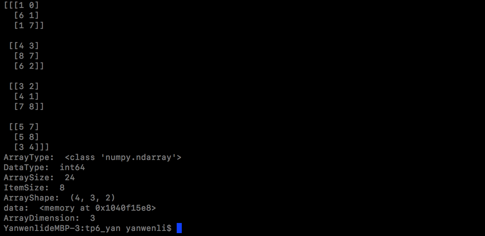
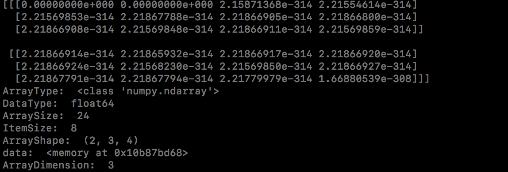
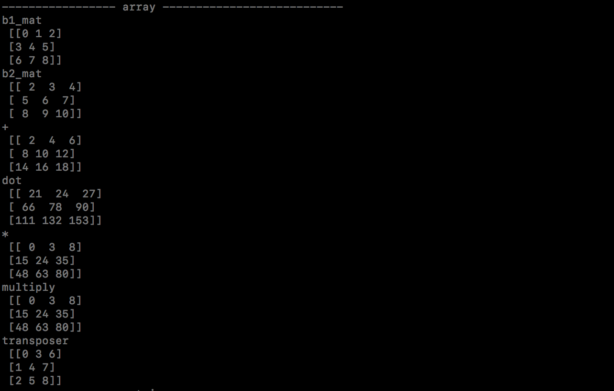
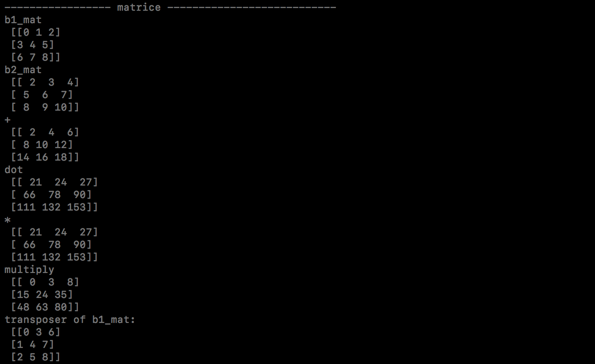
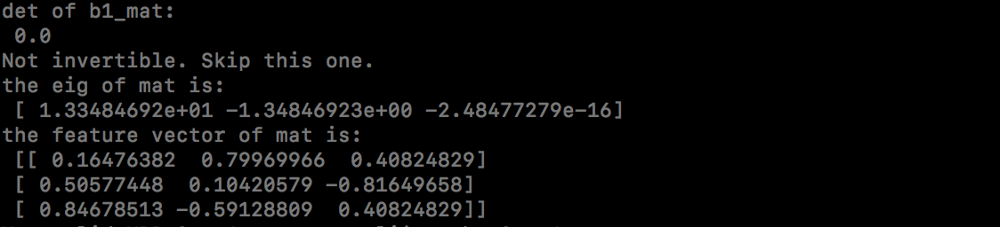
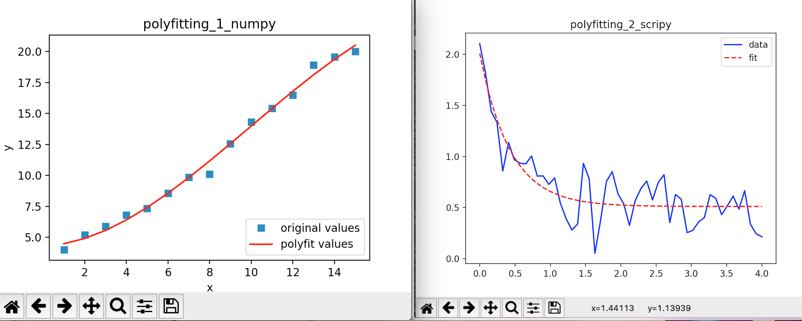
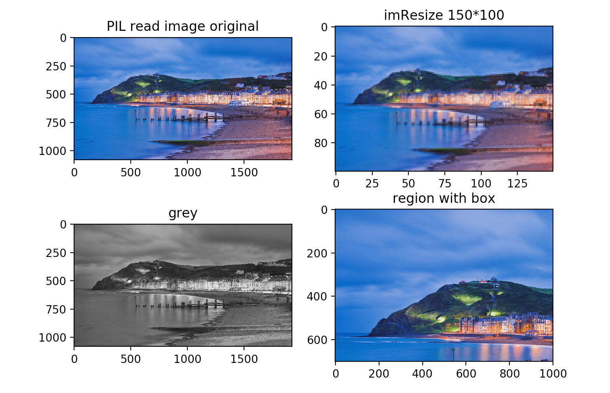

## Python TP

PENG Hanyuan & YAN Wenli

---

> Les codes du TP sont fournis dans le fichier `Code_TP.zip`.


### TP1 - Fichiers

Ce sujet nous permet d'utiliser:
- Les fichiers: Lecture et l'écriture d'un fichier,
- Classe: Surcharge des méthodes, getter, setter.


#### Fichier

Quand nous voulons lire un fichier text (ou json, xml etc..), c'est mieux d'indiquer le codage de fichier pour que les textes affiche correctement.

``` python
def func():
    print(' Bonjour le monde !')
    print('\t1. Choisir un nom de fichier','\t2. Ajouter un texte','\t3. Afficher le fichier complet', '\t4. Vider le fichier', '\t5. Quitter',sep='\n')

    filename = ''
    while True:
        inp = input('Votre choix: ')
        if inp == '1':
            filename = input('Nom de fichier: ')
            print('Nom du fichier:', filename)
        elif inp == '2':
            if not filename:
                print('Choisir un nom de fichier!')
            else:
                print('Nom du fichier: ', filename)
                with open(filename, "a", encoding="utf-8") as fic:
                    text = input("Votre Texte: ")
                    fic.write(text)
        elif inp == '3':
            if not filename:
                print('Choisir un nom de fichier!')
            else:
                print('Nom du fichier: ', filename)
                with open(filename, "r", encoding="utf-8") as fic:
                    print(fic.read(),end='\n')
        elif inp == '4':
            with open(filename, "w+") as fic:
                fic.truncate()
        elif inp == '5':
            break
        else:
            raise Exception("Error input, programme va quitter")


if __name__ == "__main__":
    try:
        func()
    except Exception as e:
        print(e)
```

###### Résultat:


#### Classe

##### Surcharge des méthodes

``` python
class Date:
    def __init__(self,date):
        self.date = date
    def __eq__(self, other):
        if other.date == self.date:
            return True
        else:
            return False
    def __lt__(self,other):
        if self.date < other.date:
            return True
        else:
            return False

date = Date(1.2)
date2 = Date(1.3)

print(date > date2)

```

###### Résultat:


###### Des point importants

Il faut utiliser le nom particulier pour surcharger les opérateur (+, =, <, etc)


##### Attributs et Getter, Setter

> Des codes de cette partie sont dans le `Code_TP.zip`. Fichier `tp1_etudiant.py`

Résultat:



###### Des point importants

(莉莉这里你看一下有没有需要注意的点。。。)


### TP2 - Tkinter

### TP3 - Exceptions et chiffrement

### TP4 - Matplotlib

### TP5 - Base de données

### TP6 - Numpy et Scipy
Dans ce TP, on a bien compris des fonctionnalités et des caractéristiques de Numpy et Scripy en réalisant tous les exercices.

Nous avons créé trois fichers:
`tp6.py`(Numpy),
`tp6_scripy.py`  (Scripy)
`tp6_matplotlib_image.py`(qui utilise PIL pour réaliser des operations sur l'image)
#### 6.1 Numpy
##### 6.1.1 Introduction simple
NumPy est le paquet fondamental du calcul scientifique et une bibliothèque tierce essentielle à l'analyse de données en Python.

L'émergence de np résout dans une certaine mesure le problème des performances informatiques médiocres en Python, en même temps le fournisse des types de données plus précis. On peut dire que NumPy est la bibliothèque la plus élémentaire de traitement de données ou de calcul scientifique.

Il contient:
- Un puissant objet tableau N-dimensionnel
- Fonctions sophistiquées (diffusion)
- Outils d'intégration de code C / C ++ et Fortran
- Algèbre linéaire utile, transformée de Fourier et capacités de nombres aléatoires

##### 6.1.2 Travail du TP
###### Afficher des attributs du tableau
```python
def creationA():
    #Créer un tableau de dimension 3 avec un shape de (4, 3, 2) remplit avec des nombres aléatoires.
    a1 = np.random.empty(0,10,size=[4,3,2])

    #Vous afficherez les attributs du tableau : ndim, shape, size, dtype, itemsize, data.
    print(a1)
    print("ArrayType: ",type(a1))
    print("DataType: ",a1.dtype)
    print("ArraySize: ",a1.size)
    print("ItemSize: ",a1.itemsize)
    print("ArrayShape: ",a1.shape)
    print("data: ",a1.data)
    print("ArrayDimension: ",a1.ndim)
```
Résultats:
int:

float:


###### Des opérations sur array avec Numpy
On a créé deux matrices pour faire le `+`,`dot`, `*`, `multiply` et `transposer`.

```python
b1_arr = np.arange(0,9).reshape(3,3)   # ne contient pas 9  (0-8)
b2_arr = np.arange(2,11).reshape(3,3)   # ne contient pas 11  (2-10)
b1_mat = np.mat(b1_arr)
b2_mat = np.mat(b2_arr)
```

Pour bien comprendre les différences des opérations pour Array et Matrice, on a testé avec les deux:
```python
print("----------------- array ---------------------------")
print("b1_mat\n",b1_arr)
print("b2_mat\n",b2_arr)

print("+\n", b1_arr + b2_arr)
print("dot\n", np.dot(b1_arr, b2_arr))
print("*\n", (b1_arr) * (b2_arr))
print("multiply\n", np.multiply(b1_arr, b2_arr))
print("transposer\n", np.transpose(b1_arr))
```


```python
print("----------------- matrice ---------------------------")
print("b1_mat\n",b1_mat)
print("b2_mat\n",b2_mat)
print("+\n", b1_mat + b2_mat)
print("dot\n", np.dot(b1_mat, b2_mat))
print("*\n", (b1_mat) * (b2_mat))
print("multiply\n", np.multiply(b1_mat, b2_mat))
print("transposer of b1_mat: \n", np.transpose(b1_mat))
```


Selon les résulats, on peut faire la conclusion:
- `dot`: Pour un tableau de rang 1, effectuez la multiplication de position correspondante puis faire la somme；pour un tableau à deux dimensions dont le rang n'est pas égal à 1, effectuez la multiplication matricielle.
- `*`:  Effectuer la multiplication de position correspondante sur le tableau; effectuer une multiplication matricielle sur des matrices.

###### Autres opérations sur matrice
Calculer le déterminant, l’inverse, les valeurs et vecteurs propres d’une matrice.

```python
print("det of b1_mat: \n", np.linalg.det(b1_mat))
#le déterminant égale à 0, ce matrice est invertible
try:
    inverse = np.linalg.inv(b2_mat)
    print("inverse of b2_mat: \n", inverse)
except np.linalg.LinAlgError:
    print("Not invertible. Skip this one.") #Si non invertible. Passer à la suite
    pass
else:
    print("ok")
eig1,eig2 = np.linalg.eig(b1_mat)
print("the eig of mat is:\n",eig1)
print("the feature vector of mat is:\n",eig2)
```


#### 6.2 Scipy
##### 6.2.1 Introduction simple
SciPy est un module dans Python construit sur Numpy qui intègre plusieurs algorithmes mathématiques et des fonctions pratiques. En fournissant aux utilisateurs des commandes et des classes de haut niveau, SciPy augmente considérablement la possibilité de manipuler et de visualiser les données dans des sessions interactives Python.

SciPy contient des modules:
- Optimisation
- Algèbre linéaire
- Intégration
- Interpolation
- Fonctions spéciales
- Transformée de Fourier rapide
- Traitement du signal et de traitement d'images
- Résolution d'équations différentielles ordinaires
- D'autres calculs couramment utilisés en science et en ingénierie.

##### 6.2.2 Travail du TP
###### Approcher un ensemble de points par une courbe
Pour une solution polynomiale simple,on peut utiliser simplement la fonction numpy: `polyfit (x, y, degree)`.
Pour le fitting exponentiel et puissant, on peut utiliser curve_fit dans `scipy.optimize`

Donc on a fait des exercices avec deux façons:
```python
def polyfitting_1():

    x = np.arange(1, 16, 1)
    num = [4.00, 5.20, 5.900, 6.80, 7.34,
           8.57, 9.86, 10.12, 12.56, 14.32,
           15.42, 16.50, 18.92, 19.58, 20.00]
    y = np.array(num)

    #Fit avec un polynôme cubique
    f1 = np.polyfit(x, y, 3)
    p1 = np.poly1d(f1)
    print(p1)

    #Fit y value
    # methode2: yvals=np.polyval(f1, x)
    yvals = p1(x)

    #Dessiner un graphe
    plot1 = plt.plot(x, y, 's',label='original values')
    plot2 = plt.plot(x, yvals, 'r',label='polyfit values')
    plt.xlabel('x')
    plt.ylabel('y')
    plt.legend(loc=4) #legend:right-down
    plt.title('polyfitting_1_numpy')
    plt.show()
    plt.savefig('test.png')
```

```python
def polyfitting_2():
    xdata = np.linspace(0, 4, 50)
    y = func(xdata, 1.5, 2.3, 0.5)
    ydata = y + 0.2 * np.random.normal(size=len(xdata))
    plt.plot(xdata,ydata,'b-',label='data')
    #Ajustement des moindres carrés non linéaire
    popt, pcov = curve_fit(func, xdata, ydata)
    #popt[], trois inconnus en attente de résolution a,b,c
    y2 = [func(i, popt[0],popt[1],popt[2]) for i in xdata]
    plt.plot(xdata,y2,'r--',label='fit')
    plt.title('polyfitting_2_scripy')
    plt.legend()
    plt.show()
    print(popt)
```



#### 6.3 Traitement sur images
Pour mieux comparer, on a récupéré tous les résultats ensemble:
Pour lire une image jpeg: `matplotlib.imread` ne marche que sur le format`.png` mais pas sur `.jpg`, alors après des tests sur toutes les façons possibles, on a choissi `PIL`.

et afficher l’image originale et réduite en taille
```python
test_image = Image.open(imagepath_2)
imResize = test_image.resize((150,100), Image.ANTIALIAS)
l_image = test_image.convert('L')
box = (0, 0, 1000, 700)             
region = test_image.crop(box)

plt.subplot(221)
plt.title('PIL read image original')
plt.imshow(test_image)
plt.subplot(222)
plt.title('imResize 150*100')
plt.imshow(imResize)
plt.subplot(223)
plt.title('grey')
plt.imshow(l_image)
plt.subplot(224)
plt.title('region with box')
plt.imshow(region)
plt.show()
```


### TP7 - Serveur et page web (Django)

### TP8 - Prog. asynchrone et fourmis
